# VirtualCafe Project Flowcharts

This document contains comprehensive flowcharts for the VirtualCafe online study platform.

---

## Table of Contents
1. [Authentication Flow](#1-authentication-flow)
2. [Main Application Flow](#2-main-application-flow)
3. [Study Room Flow](#3-study-room-flow)
4. [Solo Study Session Flow](#4-solo-study-session-flow)
5. [Progress Tracking Flow](#5-progress-tracking-flow)
6. [Room Management Flow](#6-room-management-flow)
7. [Chatbot Interaction Flow](#7-chatbot-interaction-flow)
8. [Overall System Architecture](#8-overall-system-architecture)

---

## 1. Authentication Flow

### Sign Up & Email Verification

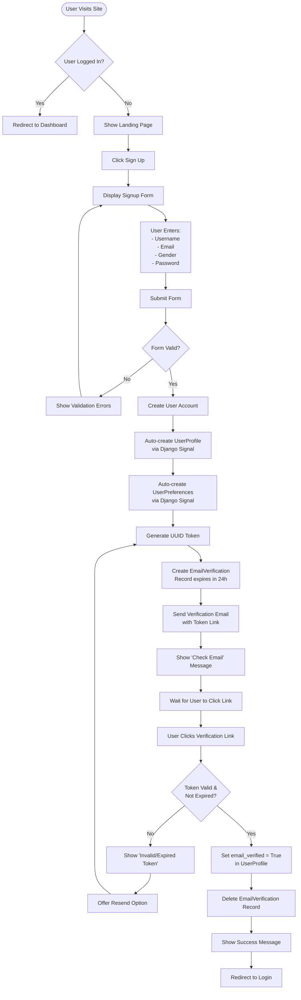

### Login Flow

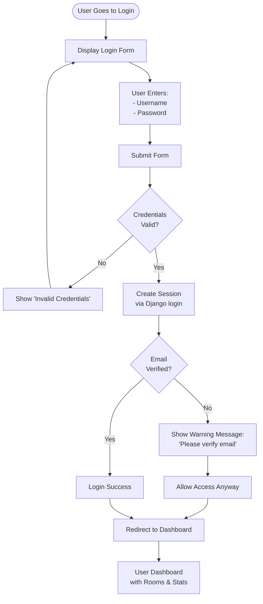

### Password Reset Flow

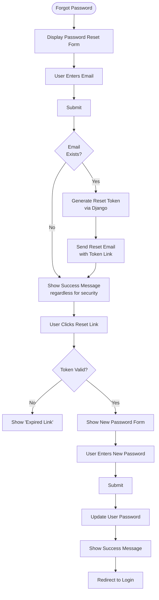

---

## 2. Main Application Flow

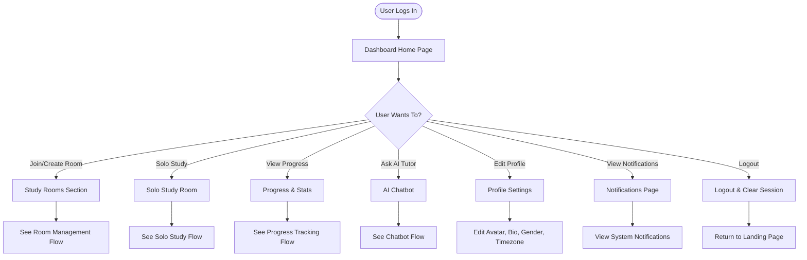

---

## 3. Study Room Flow

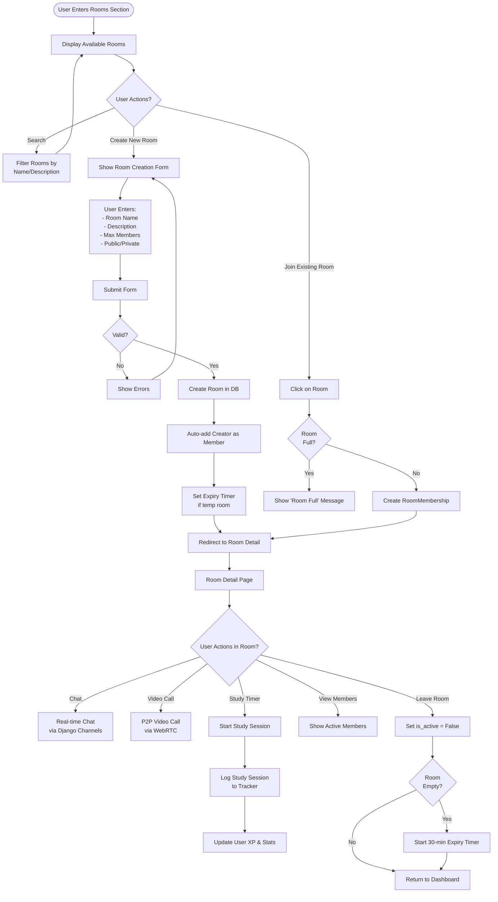

---

## 4. Solo Study Session Flow

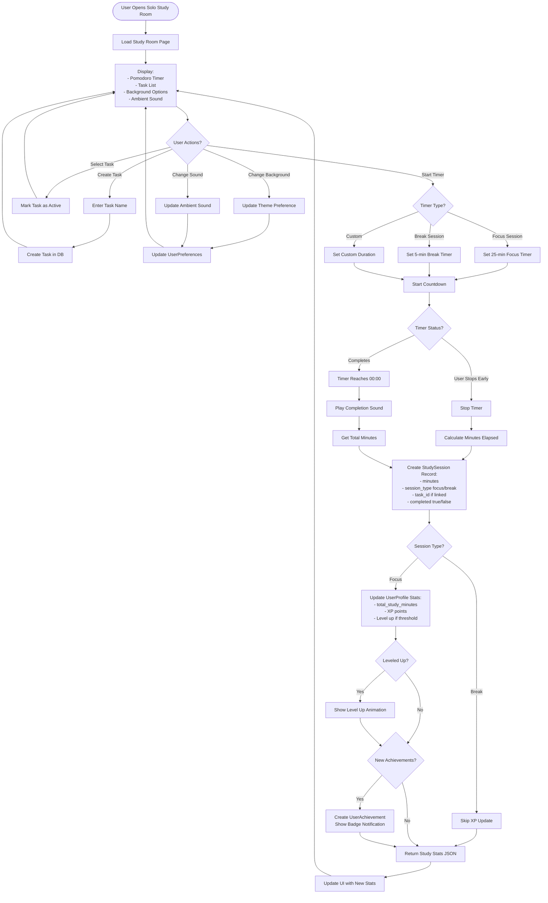

---

## 5. Progress Tracking Flow

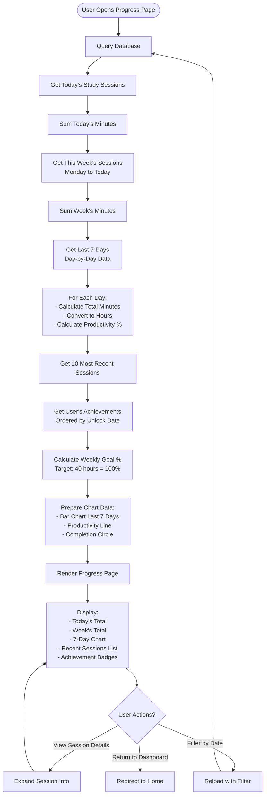

---

## 6. Room Management Flow

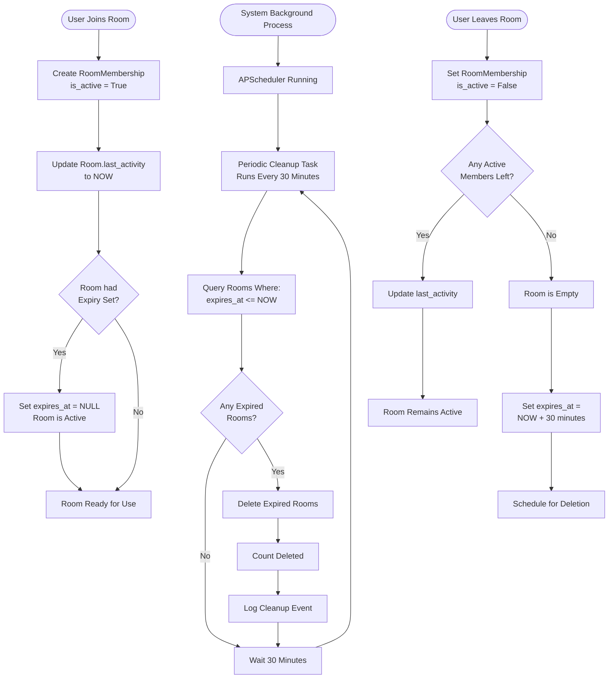

---

## 7. Chatbot Interaction Flow

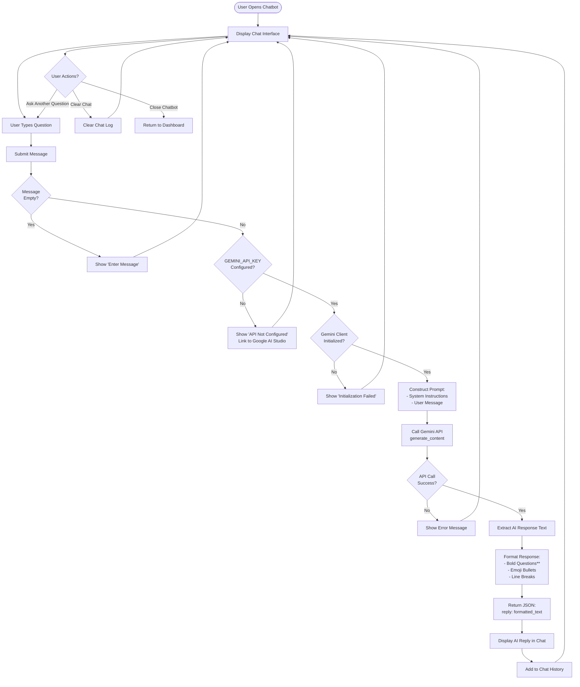

---

## 8. Overall System Architecture

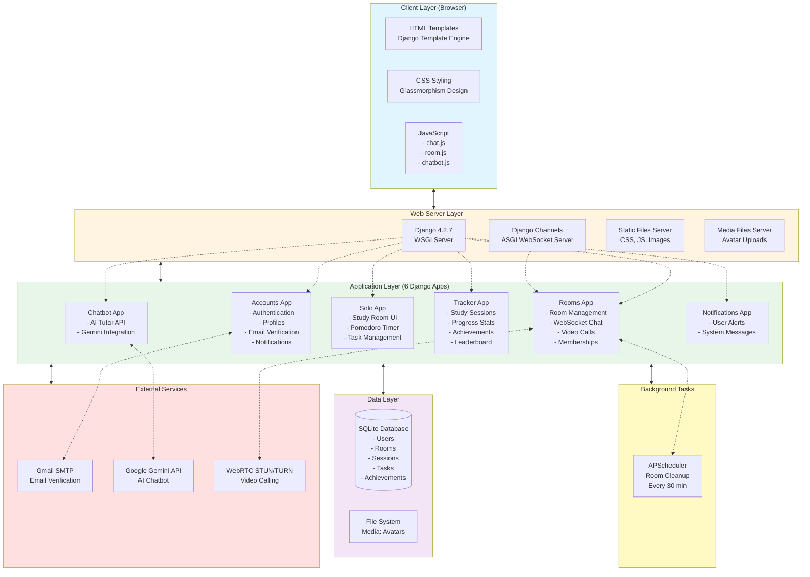

---

## System Flow Summary

### Key User Journeys

1. **New User Journey**
   - Landing Page → Sign Up → Email Verification → Login → Dashboard → Choose Study Mode

2. **Study Session Journey**
   - Dashboard → Solo Study Room → Start Timer → Complete Session → Save Progress → View Stats

3. **Collaborative Study Journey**
   - Dashboard → Browse Rooms → Join/Create Room → Chat & Video → Study Together → Leave Room

4. **Progress Tracking Journey**
   - Dashboard → Progress Page → View Charts → See Achievements → Set Goals

5. **AI Assistance Journey**
   - Any Page → Open Chatbot → Ask Question → Get AI Tutor Response → Continue Studying

### Technology Integrations

- **Django Framework**: Core MVC architecture, ORM, authentication
- **Django Channels**: WebSocket for real-time chat in study rooms
- **WebRTC**: Peer-to-peer video calling between room members
- **Google Gemini AI**: Intelligent tutoring chatbot
- **Gmail SMTP**: Email verification system
- **APScheduler**: Background task for room cleanup
- **SQLite**: Development database (PostgreSQL-ready)

### Security Features

- Email verification before full access
- CSRF protection on all forms
- Environment-based configuration (.env file)
- Password reset with token expiration
- Session management with Django auth
- Input validation on all user data

---

## Database Models Overview

```mermaid
erDiagram
    User ||--o| UserProfile : has
    User ||--o| UserPreferences : has
    User ||--o{ StudySession : creates
    User ||--o{ Task : creates
    User ||--o{ Room : creates
    User ||--o{ RoomMembership : has
    User ||--o{ UserAchievement : earns
    User ||--o| EmailVerification : has
    
    Room ||--o{ RoomMembership : contains
    Room ||--o{ Message : contains
    
    Task ||--o{ StudySession : linked_to
    
    Achievement ||--o{ UserAchievement : unlocked_as
    
    User {
        int id PK
        string username
        string email
        string password
    }
    
    UserProfile {
        int id PK
        int user_id FK
        string avatar
        string gender
        string bio
        int total_study_minutes
        int xp
        int level
        int study_streak
        bool email_verified
    }
    
    UserPreferences {
        int id PK
        int user_id FK
        string theme
        string background
        string ambient_sound
        int focus_duration
    }
    
    Room {
        int id PK
        string name
        string description
        int created_by_id FK
        int max_members
        bool is_public
        datetime expires_at
        datetime last_activity
    }
    
    RoomMembership {
        int id PK
        int room_id FK
        int user_id FK
        bool is_active
        datetime joined_at
    }
    
    StudySession {
        int id PK
        int user_id FK
        int task_id FK
        int minutes
        string session_type
        bool completed
        datetime started_at
        datetime ended_at
    }
    
    Task {
        int id PK
        int user_id FK
        string name
        bool completed
        datetime created_at
    }
    
    Achievement {
        int id PK
        string name
        string description
        string icon
        string category
        int requirement
    }
    
    UserAchievement {
        int id PK
        int user_id FK
        int achievement_id FK
        datetime unlocked_at
    }
    
    EmailVerification {
        int id PK
        int user_id FK
        string token UUID
        datetime created_at
        datetime expires_at
    }
```

---

## File Structure Map

```
VirtualCafe/
├── accounts/          # User authentication & profiles
│   ├── views.py       # signup, login, verify_email, profile
│   ├── models.py      # UserProfile, UserPreferences, EmailVerification
│   ├── forms.py       # SignUpForm, ProfileUpdateForm
│   └── urls.py        # /login, /signup, /verify-email/
│
├── rooms/             # Study room management
│   ├── views.py       # home, create_room, room_detail
│   ├── models.py      # Room, RoomMembership, Message
│   ├── consumers.py   # WebSocket chat handler
│   ├── routing.py     # WebSocket URL routing
│   └── scheduler.py   # APScheduler for cleanup
│
├── solo/              # Solo study mode
│   ├── views.py       # solo_study_room, save_session
│   └── task_views.py  # task CRUD operations
│
├── tracker/           # Progress tracking
│   ├── views.py       # progress, leaderboard, study_goals
│   ├── models.py      # StudySession, Task, Achievement
│   └── management/    # create_achievements command
│
├── chatbot/           # AI tutor
│   ├── views.py       # chatbot_api (Gemini integration)
│   └── urls.py        # /chatbot/
│
├── notifications/     # User notifications
│   └── models.py      # Notification model
│
├── templates/         # HTML templates
│   ├── base.html      # Base template with sidebar
│   ├── accounts/      # login.html, signup.html, profile.html
│   ├── rooms/         # home.html, room_detail.html
│   └── solo/          # study_room.html
│
├── static/            # CSS, JS, Images
│   ├── css/           # style.css, chatbot.css
│   └── js/            # chat.js, room.js, chatbot.js
│
├── virtualcafe/       # Django project settings
│   ├── settings.py    # Configuration (uses .env)
│   ├── urls.py        # Main URL routing
│   └── asgi.py        # ASGI config for Channels
│
├── .env               # Environment variables (secrets)
├── db.sqlite3         # SQLite database
├── manage.py          # Django management script
└── requirements.txt   # Python dependencies
```

---

## API Endpoints Summary

### Accounts App
- `GET /` - Landing page (if not authenticated)
- `GET /signup/` - Sign up form
- `POST /signup/` - Create new user
- `GET /login/` - Login form
- `POST /login/` - Authenticate user
- `GET /logout/` - Log out user
- `GET /verify-email/<uuid>/` - Verify email with token
- `GET /profile/` - View user profile
- `POST /profile/edit/` - Edit profile
- `GET /notifications/` - View notifications

### Rooms App
- `GET /home/` - Dashboard (rooms list)
- `GET /create/` - Create room form
- `POST /create/` - Create new room
- `GET /room/<slug>/` - Room detail page
- `POST /join/` - Join room by code
- `WS /ws/room/<slug>/` - WebSocket for real-time chat

### Solo App
- `GET /study/` - Solo study room
- `POST /study/save-session/` - Save study session
- `POST /study/tasks/` - Create task
- `PUT /study/tasks/<id>/` - Update task
- `DELETE /study/tasks/<id>/` - Delete task

### Tracker App
- `GET /progress/` - Progress page with stats
- `GET /leaderboard/` - User leaderboard
- `GET /goals/` - Study goals page

### Chatbot App
- `POST /chatbot/` - AI tutor API (JSON request/response)

---

## Deployment Flow

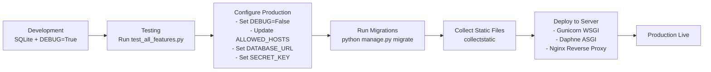

---

**Document Version:** 1.0  
**Last Updated:** February 10, 2026  
**Project:** VirtualCafe - Online Study Platform
